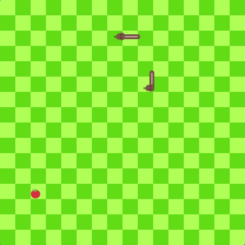

*version 2 - Multiplayer*

The old snake game written in JS for Hacktoberfest 2018. I threw the base of this together in a few minutes for the sole purpose of contributing real issues for Hacktoberfest and with the help of many great developers we have managed to turn it into a really cool playable game.

**Play the game here: https://pamblam.github.io/snek/**

### Thank you's

Thank you to everyone who contributed. If I have time to write a socket server for two *live* players in the next 9 days I will do so, else we'll leave it as is. Thanks to all 71 developers who contributed to this project - most of whom were first time contributors. You guys did a great job!

### Contributors

 - (╯°□°）╯︵ uᴉǝssnH ɐɟɐʇsoW ([mostafahussein](https://github.com/mostafahussein))
 - aksungurlu  ([aksungurlu](https://github.com/aksungurlu))
 - AmaanH ([AmaanH](https://github.com/AmaanH))
 - Amit Merchant ([amitmerchant1990](https://github.com/amitmerchant1990))
 - Bradley  ([bradleyasu](https://github.com/bradleyasu))
 - Bruno Nakayabu  ([BrNaka](https://github.com/BrNaka))
 - Cameron Brill ([gaiscioch](https://github.com/gaiscioch))
 - Charlie ([atlasRand](https://github.com/atlasRand))
 - clizano  ([clizano](https://github.com/clizano))
 - Cole Reinhart  ([ColeReinhart](https://github.com/ColeReinhart))
 - Conor Hinchee  ([captnstarburst](https://github.com/captnstarburst))
 - D. L. Marrero  ([dlmarrero](https://github.com/dlmarrero))
 - Daniel Torres ([TORRESDESIGN](https://github.com/TORRESDESIGN))
 - David Quan  ([David-Quan00](https://github.com/David-Quan00))
 - Derek  ([DirtySoc](https://github.com/DirtySoc))
 - dl471 ([dl471](https://github.com/dl471))
 - Eddie Ornelas  ([ornelasEduardo](https://github.com/ornelasEduardo))
 - gramstrong  ([gramstrong](https://github.com/gramstrong))
 - Harald Bergqvist ([Yoldrim](https://github.com/Yoldrim))
 - Hardik500 ([Hardik500](https://github.com/Hardik500))
 - Henrique Melanda  ([hjdesigner](https://github.com/hjdesigner))
 - Isaac ([iojw](https://github.com/iojw))
 - Jannis  ([thisfro](https://github.com/thisfro))
 - Jaqueline Lemes Botaro  ([JaqueLB](https://github.com/JaqueLB))
 - Jared Glaser ([jaredglaser](https://github.com/jaredglaser))
 - Jeroen  ([jpabeem](https://github.com/jpabeem))
 - Joel Hanson ([Joel-hanson](https://github.com/Joel-hanson))
 - Joel Rodriguez ([joelerll](https://github.com/joelerll))
 - Josef Malacka Jr. ([shlavocky](https://github.com/shlavocky))
 - Juan Manuel Ramallo  ([juanmanuelramallo](https://github.com/juanmanuelramallo))
 - Kevin ([kevinko12323](https://github.com/kevinko12323))
 - kushagra Agarwal ([Kushagra-ag](https://github.com/Kushagra-ag))
 - Lee  ([LeeConnelly12](https://github.com/LeeConnelly12))
 - Lionel Foucambert ([LionelFW](https://github.com/LionelFW))
 - Logan Bynes ([loganeb](https://github.com/loganeb))
 - Lu-Vuong Le ([luvuong-le](https://github.com/luvuong-le))
 - Martin Splitt  ([AVGP](https://github.com/AVGP))
 - Michael Flores ([michaelprflores](https://github.com/michaelprflores))
 - Michał Krychniak  ([KauczukoweJajo](https://github.com/KauczukoweJajo))
 - Miguel Gallardo ([MiguelGT98](https://github.com/MiguelGT98))
 - Mobeen Abdullah  ([mobeenabdullah](https://github.com/mobeenabdullah))
 - Mohammed Safwat ([mohammedsafwat](https://github.com/mohammedsafwat))
 - Natalie Wyll ([nwyll](https://github.com/nwyll))
 - nawwx3  ([nawwx3](https://github.com/nawwx3))
 - necrashter  ([necrashter](https://github.com/necrashter))
 - nezirajkujtim ([nezirajkujtim](https://github.com/nezirajkujtim))
 - nicholasruan  ([nicholasruan](https://github.com/nicholasruan))
 - niilz ([niilz](https://github.com/niilz))
 - Nikita Rudenko ([nick-rudenko](https://github.com/nick-rudenko))
 - nikossoftwaredev  ([nikossoftwaredev](https://github.com/nikossoftwaredev))
 - Njazi Shehu ([njaaazi](https://github.com/njaaazi))
 - Peter Mandile ([peterm94](https://github.com/peterm94))
 - Pritam Sinha  ([sinha-p](https://github.com/sinha-p))
 - Przemysław Półrolniczak  ([PrzemyslawPolrolniczak](https://github.com/PrzemyslawPolrolniczak))
 - Ramazan ([RamazanM](https://github.com/RamazanM))
 - rdittrich97  ([rdittrich97](https://github.com/rdittrich97))
 - Richa Agarwal ([richa031](https://github.com/richa031))
 - Rob Parham ([Pamblam](https://github.com/Pamblam))
 - Saravanan Ramupillai ([saravanan10393](https://github.com/saravanan10393))
 - Shiva Kaushal ([shivakaushal](https://github.com/shivakaushal))
 - Siang Huang ([sianghuang](https://github.com/sianghuang))
 - SMRSAN ([smrsan76](https://github.com/smrsan76))
 - Steven  ([StevenJW](https://github.com/StevenJW))
 - Sulamita Morales ([kyusulamita](https://github.com/kyusulamita))
 - sven ([svengiebel](https://github.com/svengiebel))
 - TiffanieJ ([TiffanieJ](https://github.com/TiffanieJ))
 - Vincent Lobbestael ([lobbestaelv](https://github.com/lobbestaelv))
 - Viswa Sai ([visvxplore](https://github.com/visvxplore))
 - WicoGoHome ([wicogohome](https://github.com/wicogohome))
 - WooodHead ([WooodHead](https://github.com/WooodHead))
 - Yvonne Kim ([yvonneKim](https://github.com/yvonneKim))
